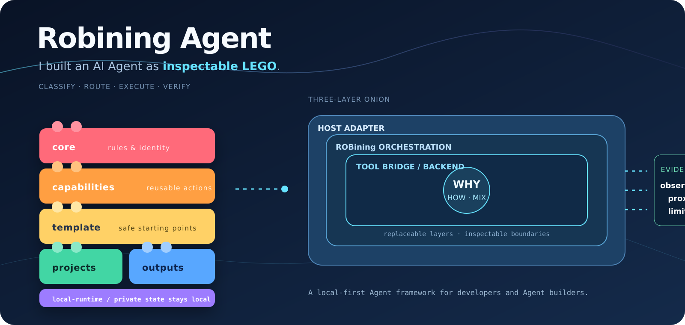

# Robining Agent



Robining Agent 是一个面向 Agent 构建者的可移植、本地优先编排框架。它把用户意图转成可检查的执行路线，并将宿主运行时、工具桥接与私有数据彼此隔离。

## 核心思想

- 六大语义桶：`core`、`capabilities`、`template`、`projects`、`outputs`、`local-runtime`。
- 三层洋葱架构：宿主适配层 → Robining 编排层 → 工具桥接/后端。
- 明确的问题类型：`WHY`、`HOW`、`MIX`。
- 明确的证据状态：`ok`、`partial`、`blocked`。
- 不需要凭据、个人记忆、机器状态或真实项目数据即可运行最小内核。
- 核心 Agent 规范位于 `core/agent.md`，GitHub Agent 入口位于 `.github/agents/robining-agent.agent.md`。

## 通过 npm 安装

```bash
npm install --global robining-agent
robining
```

当前 npm 发布版本为 `0.4.0`。更新已有安装：

```bash
npm update --global robining-agent
```

可以运行 `robining doctor` 检查运行时和当前供应商。

## 从源码开发安装

```bash
npm install
npm run build
npm link
robining doctor
```

如果在终端中直接运行 `robining` 且尚未配置供应商，向导也会自动打开。

npm 正式发布后，也可以直接使用 `npm install -g robining-agent` 全局安装。

首次使用只需运行一次配置向导：

```bash
robining setup
robining
```

终端界面会清楚区分用户输入、工具活动和 Agent 最终回答。回答默认按
Markdown 排版，支持标题、列表、代码块和证据边界；如需纯文本，可设置
`NO_COLOR=1`。

向导支持 DeepSeek、Kimi（月之暗面）、GLM（智谱）、OpenAI-compatible 端点和 Anthropic。供应商偏好保存在用户目录的 `config.json`，API key 单独保存在权限为 `0600` 的 `auth.json` 中；环境变量优先，因此 CI 和密钥管理器仍可直接使用。

本地开发：

```bash
npm install
npm run build
```

也可以不用向导，直接通过环境变量配置：

```bash
# DeepSeek
ROBINING_PROVIDER=deepseek DEEPSEEK_API_KEY=... robining
# Kimi
ROBINING_PROVIDER=kimi KIMI_API_KEY=... robining
# GLM
ROBINING_PROVIDER=glm GLM_API_KEY=... robining
# OpenAI-compatible
ROBINING_PROVIDER=openai-compatible OPENAI_API_KEY=... robining
# Anthropic
ROBINING_PROVIDER=anthropic ANTHROPIC_API_KEY=... robining
```

预设模型和端点可通过 `OPENAI_MODEL`、`OPENAI_BASE_URL` 覆盖。不要把
`auth.json` 或 API key 提交到 Git、日志或 issue。

每次运行结束时会显示 Agent 的判断路线：`WHY`、`HOW` 或 `MIX`，以及选中的
六桶。`WHY` 重点分析原因、机制、证据和限制；`HOW` 重点给出目标、行动和
验证；`MIX` 先解释原因，再给出解决方案。

路由内核和测试：

```bash
python3 -m capabilities.robining_agent.cli route --role reusable-capability --lifecycle live --reuse-scope repo-wide --privacy public
python3 -m capabilities.robining_agent.cli classify --text "为什么测量结果发生变化？"
python3 -m unittest discover -s template/tests
npm test
```

## CLI 命令

```text
robining                         交互式 REPL
robining setup                   首次供应商配置向导
robining run --prompt <text>      执行一次 headless 任务
robining resume <id> --prompt <text> 继续会话
robining sessions                 列出本地会话
robining doctor                   检查运行时和模型配置
```

交互模式中可以使用 `/setup` 更换供应商，使用 `/help` 查看命令。同一个交互
进程会持续使用当前 session；使用 `/new` 才会开启新 session。`/sessions` 只
显示会话摘要，`/resume <session-id>` 可以恢复旧对话。

第一版采用 Node 兼容的 TypeScript，不依赖 Bun 专属 API，因此可以在 Bun
下运行；CI 会使用 Bun 再次执行构建和测试。

## 目录结构

| 目录 | 用途 |
|---|---|
| `core/` | 公开宪法与路由规则 |
| `capabilities/` | 编排、契约与公开 skills |
| `template/` | 示例与测试 |
| `projects/example/` | 匿名示例项目 |
| `outputs/` | 输出协议占位 |
| `local-runtime/` | 运行态接口占位 |

## 范围与限制

本仓库提供路由契约和可移植编排逻辑，不包含 LLM、求解器、MCP 凭据、个人记忆或特定宿主运行时。

## 许可证

本版本的原创内容采用 MIT。第三方材料必须保留其原始许可证，详见 `NOTICE` 和 `provenance-and-license-matrix.md`。
