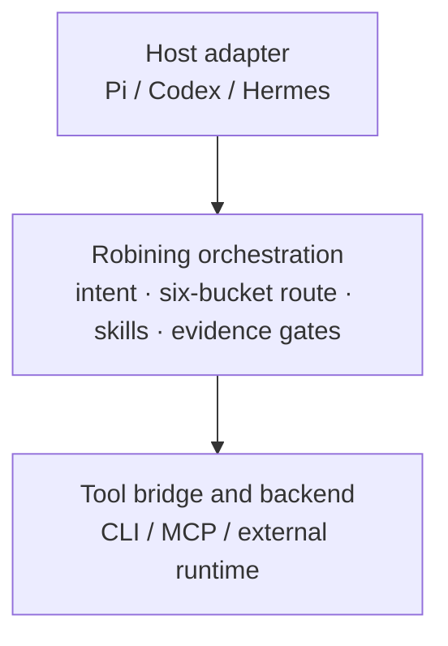

# Three-layer onion architecture / 三层洋葱架构

The outer layer adapts host-specific events. The middle layer is the stable
Robining Agent contract. The inner layer is replaceable and must return
machine-readable results without exposing credentials.

宿主适配层处理不同 Agent 宿主的事件；中间层承载稳定的 Robining Agent
契约；内层工具桥接和后端可替换，并且必须以机器可读结果返回，不暴露凭据。
