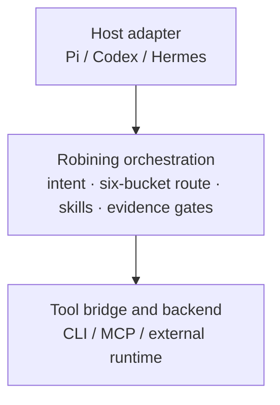

# Three-layer onion architecture

The outer layer adapts host-specific events. The middle layer is the stable
Robining Agent contract. The inner layer is replaceable and must return
machine-readable results without exposing credentials.

The host adapter handles host-specific events. The middle layer carries the
stable Robining Agent contract. The tool bridge and backend are replaceable and
must return machine-readable results without exposing credentials.
